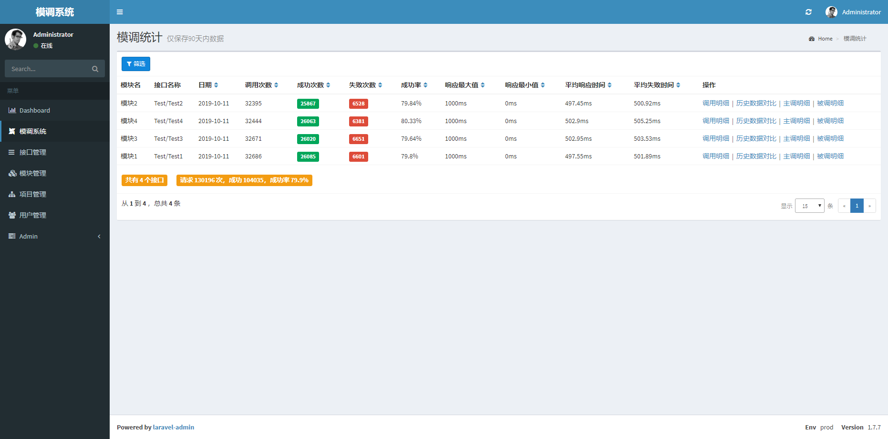
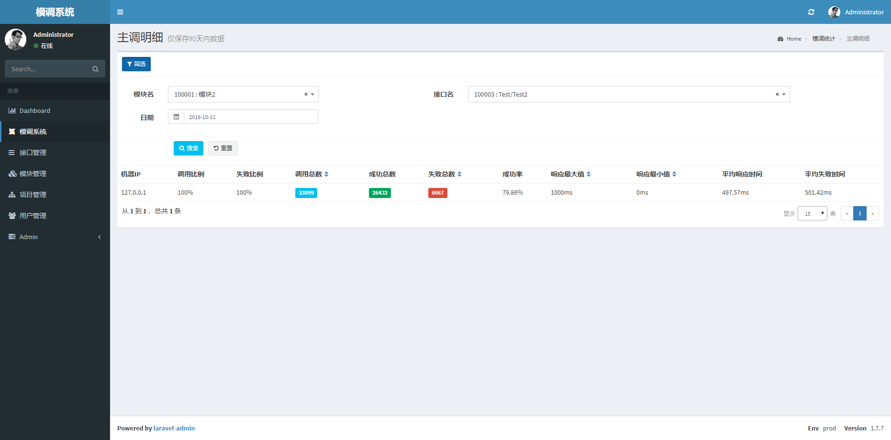

# **基于swoole的实现的laravel模调系统扩展包**

[演示地址](http://121.199.40.77/admin)

- 授权认证： admin / 123456
- 模调系统登录账号： stats / 123456

## **一、简介**
&emsp;&emsp;一个利用 laravel 与 swoole 实现的模块调用监控系统，可以实时监控各模块和接口的请求情况，包括各接口的请求次数，成功次数，请求耗时，成功率等，从而可以监控系统各模块和接口是否异常，并且可以直观的看出其调用情况，除此之外，还可设置告警功能，包括微信、短信和邮件告警，实时掌控系统接口的调用情况。

## **二、演示截图**






## **三.安装**
### **1、若未安装 swoole 扩展，则可按如下方式安装：**
```bash
wget https://github.com/swoole/swoole-src/archive/v4.4.6.tar.gz
tar zxvf v4.4.6.tar.gz
cd swoole-src-4.4.6/
/usr/bin/phpize
./configure --with-php-config=/www/server/php/72/bin/php-config //此处需改为自己的php-config路径
```

### **2、在 laravel 项目根目录下执行：**
```bash
composer require oyhdd/laravel-stats
```
&emsp;&emsp;此模调系统的后台界面基于 laravel-admin 扩展实现，可便捷的进行二次开发。若未安装laravel-admin，则需要再执行如下命令，若已安装则可忽略。
```base
php artisan vendor:publish --provider="Encore\Admin\AdminServiceProvider"
php artisan admin:install
```
### **3、发布资源文件、配置文件及初始化配置**

```
php artisan vendor:publish --provider="Oyhdd\StatsCenter\StatsCenterServiceProvider"
```
&emsp;&emsp;注：若文件已存在，可通过以下命令强制覆盖

```
php artisan vendor:publish --provider="Oyhdd\StatsCenter\StatsCenterServiceProvider" --force
```

&emsp;&emsp;然后运行下面的命令完成安装：
```bash
php artisan stats:install
```
&emsp;&emsp;文件发布成功后，会生成配置文件config/statscenter.php

### **4、配置脚本**
- 数据上报服务:后台运行
```bash
php artisan stats:server
```
- 数据统计服务：每5分钟运行一次
```bash
php artisan stats:sum
```
- 数据定时清理服务：每天运行一次，清理90天以前的数据，可在 config\statscenter.php 中修改配置
```bash
php artisan stats:clear
```

### **5、访问**
&emsp;&emsp;在浏览器打开{host}/admin 后即可访问

## **四、用法**
### **1、原理**
```
    当有接口请求时，调用 StatsCenter::tick() 统计初始时间，当请求结束时调用 StatsCenter::report() 通过 udp 方式上报数据，其中模块 id 需要向模调系统申请，接口 id 则是先从本地缓存文件获取，若不存在则向模调系统发送 tcp 请求获取，再存入本地缓存文件，若获取失败，则默认为0。
```
### **2、调用方式**

> 调用示例可参看：tests\test.php

> 调用方式可参看已封装好的类：src\StatsCenter.php

- StatsCenter::tick() 统计耗时
```
StatsCenter::tick($interface, $moduleId);
```

- StatsCenter::report() 上报数据
```
StatsCenter::report($interface, $moduleId, $success, $retCode, $serverIp);
```

&emsp;&emsp;备注：若自行统计了请求耗时 $costTime，则可只调用
```
StatsCenter::report($interface, $moduleId, $success, $retCode, $serverIp, $costTime)
```

### **3、配置**
&emsp;&emsp;可在config/statscenter.php 配置文件中设置相关参数，包含swoole配置，模调相关配置和告警配置

## **Contact us**
qq : 1040089624


